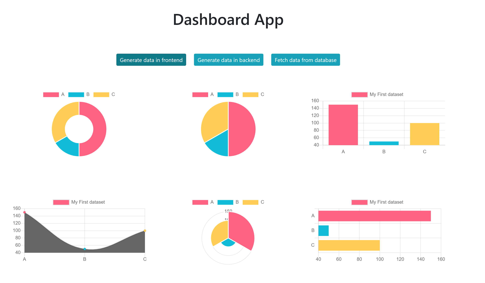

# We have terminated the backend for this project.  Old Reshuffle projects can not longer be deployed.

Keywords: dashboard, classes, reshuffle, react-bootstrap, fullstack, promise, async, chartjs

This is a [Reshuffle](https://reshuffle.com/) template.

Dashboard is a basic template to demonstrate displaying data in a chart from 3 sources - frontend , backend and db.
 
 
 

